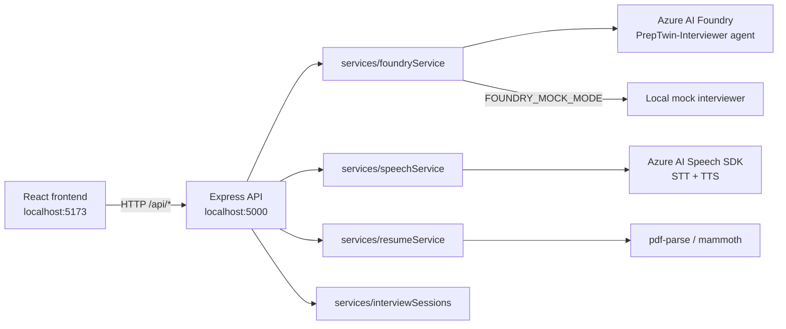

# PrepTwin — Your AI Interview Twin

PrepTwin is an AI interview coach that helps candidates prepare for real technical and behavioral interviews. Instead of generic question lists, PrepTwin runs a live, adaptive conversation with an Azure Foundry agent trained to act as a professional interviewer. It records your answers, transcribes them, scores your performance across seven coaching categories, and builds a "Candidate Twin" — a running model of your strengths and growth areas — so you can measure progress between sessions.

PrepTwin is a coaching tool. Its scores are **coaching estimates meant to help you improve**, not hiring decisions, and it never shares your interview data with employers.

---

## Key Features

- **AI interviewer** — PrepTwin connects to the `PrepTwin-Interviewer` agent deployed in Azure Foundry. The interviewer asks role-relevant, adaptive questions and responds naturally to your answers.
- **Resume & target-role setup** — Upload a resume (PDF or DOCX). The server extracts text (pdf-parse / mammoth) and lets you define your target role, experience level, and skills so the interviewer calibrates questions to the role.
- **Evaluation — 7 categories, scored 1–10** — Interview answers are assessed on categories such as technical accuracy and communication, with numeric scores and calibrated coaching estimates. All output is coaching feedback — **never a hiring decision**.
- **Adaptive difficulty** — The interviewer changes question difficulty and follow-ups based on your responses as the session progresses.
- **Chat with interview memory** — A separate chat surface keeps multi-turn context with the same interviewer, so you can ask questions or practice outside the structured interview flow.
- **Candidate Twin (in progress)** — A persistent profile of strengths and growth areas. NOTE: detailed Twin scores and the expanded Results dashboard still render design/mock data until the session-evaluation pipeline is fully wired.
- **Speech — mic recording and question playback (in progress)** — the browser can record your spoken answer and the interviewer can speak its questions — but only if Azure Speech credentials are configured; otherwise PrepTwin degrades gracefully to a fully text-based interview.

### Speech: what's real, what needs credentials

The frontend exposes **real browser mic controls**: `ResponseRecorder.tsx` records your answer via the MediaRecorder API (`audioRecorder.ts` produces WAV) and uploads it to `POST /api/speech/transcribe` for Azure AI Speech transcription. The interviewer's question is spoken aloud through `ttsPlayer.ts` via `POST /api/speech/synthesize`. If any of this fails (Speech not configured, no mic), the UI falls back to text-only with a "Continue without mic" option.

The backend **never fakes** speech: without `AZURE_SPEECH_REGION` + `AZURE_SPEECH_KEY`, the speech endpoints return `501 Not Configured`. There is no deterministic, offline "mock voice" — Speech SDK is the only path. A fully hands-free voice-driven interview loop remains a future enhancement.

---

## Tech Stack

| Area | Choice |
| --- | --- |
| Frontend | React 19 + Vite 8 (TypeScript, strict) |
| Routing | React Router v7 |
| Styling | Tailwind CSS v3 + PostCSS / Autoprefixer |
| State | React Context (`src/hooks/useApp.tsx`) |
| Charts | recharts |
| UI / Icons | @headlessui/react, clsx, tailwind-merge, lucide-react |
| Linting | Oxlint (`npm run lint`) |
| Backend | Node.js + Express 5 + TypeScript (tsx) in `server/` |
| Azure SDKs | `@azure/ai-projects`, `@azure/identity`, `microsoft-cognitiveservices-speech-sdk` |
| Document parsing | pdf-parse (PDF), mammoth (DOCX) |
| Package manager | npm |

> Note: The project is configured for the **Tailwind v3** workflow (classic `tailwind.config.js` + PostCSS plugin). Tailwind v4 packages are not compatible with this setup.

---

## Azure Services Used

- **Azure AI Foundry (project + agent)** — `PrepTwin-Interviewer` agent, referenced **by name** via the Responses API (`agent_reference`), not by an Assistants thread. `sessionId` in this codebase maps to a Responses API **conversation**, not an Assistants "thread id".
- **Azure Foundry Agent Service** — executes the agent with its configured model deployment (GPT-4.1-mini).
- **Azure AI Speech** — Speech SDK for speech-to-text (transcribe WAV) and text-to-speech (question playback). Requires a region + key.
- **Azure Entra ID** — authentication via `@azure/identity` `DefaultAzureCredential` (`az login`). The real-agent path authenticates with Entra credentials; the `AZURE_AI_API_KEY` setting is optional for the agent client and is not required to use the real agent.
- **Not used**: Azure Storage (the project stores nothing — sessions and resume context live in server memory; `@azure/storage-blob` is only a transitive dependency), and the legacy Assistants API.

If `FOUNDRY_MOCK_MODE=true` is set, the server bypasses Azure entirely and answers with a deterministic local mock interviewer, so the app can be demoed offline.

---

## Architecture



The frontend talks to the Express API (CORS-enabled for localhost:5173). The API routes forward chat/interview calls to the Foundry agent through `foundryService`, transcribe/synthesize through `speechService`, and parse resumes through `resumeService`. All session state (chat history, interview conversations, resume context) is held **in-memory server-side** — there is no database or blob storage.

---

## Project Structure

```
preptwin/
├── server/                 # Express + TypeScript backend (tsx)
│   ├── index.ts            # Express app + CORS + routing
│   ├── routes/             # chat, interview, speech, resume
│   ├── services/
│   │   ├── foundryService.ts   # @azure/ai-projects Responses API client
│   │   ├── speechService.ts    # Azure AI Speech SDK (STT/TTS)
│   │   ├── resumeService.ts    # pdf-parse / mammoth extraction
│   │   ├── resumeContext.ts    # in-memory resume context memory
│   │   └── interviewSessions.ts# in-memory interview sessions
│   ├── README.md           # detailed server + run + env documentation
│   └── .env                # server environment (never committed)
├── src/                    # React frontend (Vite)
│   ├── pages/              # Landing, Setup, InterviewRoom, Chat, Results, Twin
│   ├── components/         # ui/, setup/, interview/, results/, twin/, landing/
│   ├── hooks/useApp.tsx    # global context (candidate, interview, twin, toast)
│   ├── services/           # API clients + audioRecorder + ttsPlayer
│   ├── data/               # mock datasets
│   ├── layouts/            # MainLayout
│   ├── utils/              # helpers, shared types
│   └── App.tsx             # router + layout wiring
├── .env.example            # example client env (VITE_API_BASE_URL)
├── vite.config.ts          # dev server on :5173 (strictPort)
└── package.json            # root scripts (dev = frontend + backend)
```

---

## Prerequisites

- Node.js 20+ and npm
- An Azure account with an **Azure AI Foundry project** containing the **`PrepTwin-Interviewer` agent** (for the real agent path)
- **or** no Azure at all — set `FOUNDRY_MOCK_MODE=true` to run offline with the mock interviewer
- Optional: an **Azure AI Speech** resource (region + key) to enable voice features

---

## Setup

```bash
# 1) Install dependencies (frontend + backend)
npm install
npm --prefix server install

# 2) Configure server environment
cd server
copy .env.example .env        # Windows
#   ... or:  cp .env.example .env

# 3) Sign in to Azure (Entra) — required for the real Foundry agent
az login

# 4) If using the real agent, point it at your subscription:
az account set --subscription "<your Foundry subscription>"
```

> See `server/README.md` for the full server setup guide, environment table, and troubleshooting — including how to run against the real agent **or** the offline mock.

### Environment variables (names only)

| Variable | Where | Purpose |
| --- | --- | --- |
| `VITE_API_BASE_URL` | root `.env` | Frontend → API base URL (default `http://localhost:5000`) |
| `AZURE_AI_PROJECT_ENDPOINT` | `server/.env` | Foundry project endpoint |
| `AZURE_AI_AGENT_ID` | `server/.env` | Agent ID (`PrepTwin-Interviewer`) |
| `AZURE_AI_API_KEY` | `server/.env` | Optional — the real agent path uses Entra (`DefaultAzureCredential`), not an API key |
| `PORT` | `server/.env` | API port (default `5000`) |
| `CORS_ORIGINS` | `server/.env` | Allowed frontend origins (defaults to localhost:5173) |
| `AZURE_SPEECH_REGION` / `AZURE_SPEECH_KEY` | `server/.env` | Azure AI Speech credentials (voice features) |
| `SPEECH_LANGUAGE` / `SPEECH_VOICE` | `server/.env` | SSML language and voice for TTS |
| `FOUNDRY_MOCK_MODE` | `server/.env` | `true` = offline deterministic mock interviewer |

Never commit real keys. Keep values in `server/.env` and `/.env` (both git-ignored).

---

## Running

```bash
# Start frontend (Vite on :5173) AND backend (API on :5000) together
npm run dev
```

- Frontend: **http://localhost:5173** (Vite, `strictPort` — fails fast if the port is taken)
- API: **http://localhost:5000** (Express via `tsx watch`)

You can also run the two halves independently:

```bash
npm run dev:backend             # backend only (alias for `npm --prefix server run dev`)
```

### Other scripts

| Script | Command | What it does |
| --- | --- | --- |
| Build frontend | `npm run build` | `tsc -b && vite build` → `dist/` |
| Lint | `npm run lint` | Oxlint |
| Preview build | `npm run preview` | Serve `dist/` locally |
| Backend typecheck | `npm run --prefix server typecheck` | `tsc --noEmit` for `server/` |

---

## API Endpoints

All under `http://localhost:5000/api`.

| Method | Path | Description |
| --- | --- | --- |
| `GET` | `/health` | Health check |
| `GET` | `/ai/status` | Whether the agent / mock is connected |
| `POST` | `/chat/message` | Multi-turn chat with interview-memory context |
| `POST` | `/interview/start` | Start an interview session (name, role, experience, skills, focus) |
| `POST` | `/interview/message` | Send an interview answer, get the next question |
| `GET` | `/interview/:sessionId/summary` | Session summary |
| `POST` | `/speech/transcribe` | Speech-to-text (raw WAV, ≤10 MB) |
| `POST` | `/speech/synthesize` | Text-to-speech audio (JSON, ≤2000 chars) |
| `POST` | `/resume/parse` | Extract text from PDF/DOCX upload (≤5 MB, `x-filename` header) |
| `POST` | `/resume/clear` | Clear in-memory resume context |

---

## Verification Status (as of this README)

| Check | Result |
| --- | --- |
| Frontend build (`npm run build`) | PASS |
| Backend typecheck (`tsc --noEmit` in `server/`) | PASS |
| Lint (Oxlint) | PASS (0 errors, 8 warnings) |
| Offline mock interview regression | 7/7 PASS |
| Real agent — chat + multi-turn | PASS |
| Real agent — interview start + message | PASS |
| One-command startup (`npm run dev`) | PASS (frontend :5173 + backend :5000) |

There is no automated test harness in the repo yet; verification above was performed manually against a live Foundry agent. **Speech (voice) endpoints were not exercised against a live Speech resource** — they are code-verified only.

---

## Known Limitations

- **Not a hiring tool.** Scores are coaching estimates intended for self-improvement; PrepTwin never provides hiring recommendations and never shares data with employers.
- **Candidate Twin & detailed Results are not fully wired.** Performance charts, category scores, and the Twin profile currently render design/mock data (`MOCK_*` constants). Production evaluation from real session transcripts is the next milestone.
- **In-memory state only.** Conversations, interviews, and resume context live in server RAM with TTLs. Restarting the server loses sessions; there is no persistence.
- **Voice still requires credentials + mic.** Speech features are implemented but unverified against a live Azure Speech deployment, and there is no mock voice fallback.
- **Single-user.** No authentication or multi-user isolation yet.

---

## Future Scope

- Wire session transcripts → real 7-category evaluation and live Candidate Twin updates
- Full voice-driven interview loop (question spoken, answer transcribed, follow-ups) with a live Speech resource
- Persistent storage (e.g., Azure Storage / Cosmos DB) for history across sessions
- User accounts and multi-session progress tracking
- Deployable hosting (Foundry + static hosting / Container Apps)

---

## Demo Flow (AI-103)

1. `npm install` + `npm --prefix server install`
2. Configure `server/.env` — real agent (after `az login`) **or** `FOUNDRY_MOCK_MODE=true` for offline demo
3. `npm run dev` → open http://localhost:5173
4. Watch the Vite + backend logs confirm both live (`[FRONTEND]` / `[BACKEND]` prefixes)
5. Landing → **Setup** — enter name, target role, experience, skills, upload a resume
6. **Interview Room** — answer questions, watch the interviewer adapt
7. **Chat** — continue the conversation with full context
8. **Results / Candidate Twin** — see the (mock-data) evaluation UI and the Twin profile

Explain the architecture as Lecture from the **Architecture** diagram above: React frontend → Express API → Foundry `PrepTwin-Interviewer` agent (GPT-4.1-mini deployment) — with optional AI Speech and offline mock modes.

---

## Team

*(Team placeholder — add contributor names/roles here.)*

---

For backend internals, environment setup, and agent/mock troubleshooting, see **[`server/README.md`](server/README.md)**.